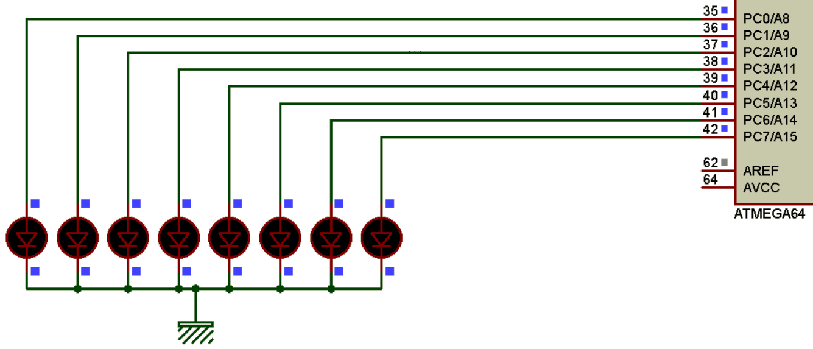
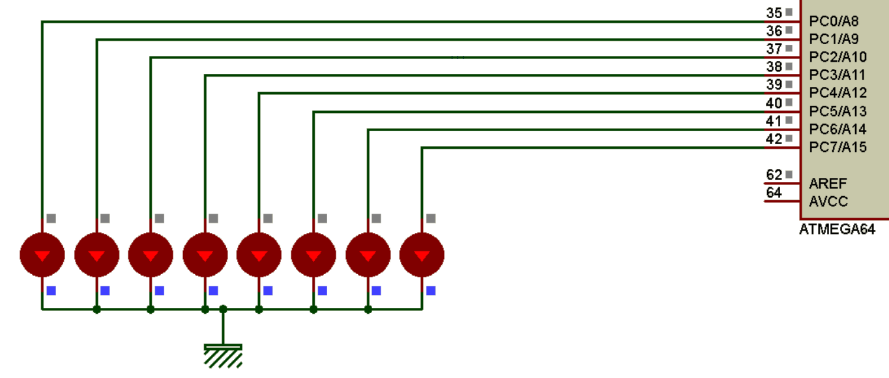

# Toggle 8 LED with PORTC in Atmega64
Question: By creating a delay of one second, write a program that will change the status of all PORTC pins once every second.
Show the toggle of PORTC with LEDs.

Answer:

After 1 second:
